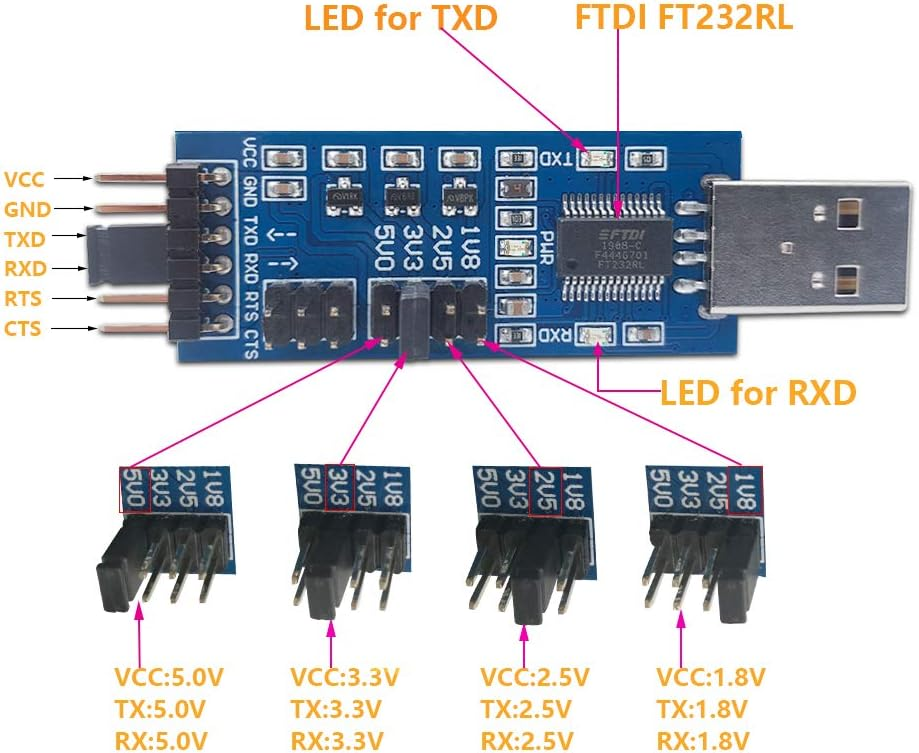

# Development Setup Guide for airborne-oxide

This guide will walk you through the process of setting up your development environment for contributing to the airborne-oxide project. Follow these steps carefully to ensure a smooth setup.

## Table of Contents

1. [Set up the Development Environment](#1-set-up-the-development-environment)
2. [Install Hardware Interfacing Tools](#2-install-hardware-interfacing-tools)
3. [Set Up the Project](#3-set-up-the-project)
4. [Configure the Build System](#4-configure-the-build-system)
5. [Write the Program](#5-write-the-program)
6. [Build the Project](#6-build-the-project)
7. [Prepare for Flashing](#7-prepare-for-flashing)
8. [Flash the Program](#8-flash-the-program)
9. [Verify and Debug](#9-verify-and-debug)

## 1. Set up the Development Environment

### a. Install Rust and Rust Rover IDE

1. Download and install Rust from https://www.rust-lang.org/tools/install
2. Follow the installation prompts, ensuring Rust is added to your system PATH
3. Download and install Rust Rover IDE from the JetBrains website
4. Open Rust Rover IDE and ensure it recognizes your Rust installation

### b. Install the GNU Arm Embedded Toolchain

1. Go to https://developer.arm.com/downloads/-/arm-gnu-toolchain-downloads
2. Download the installer for your operating system (e.g., arm-gnu-toolchain-13.3.rel1-mingw-w64-i686-arm-none-eabi.exe for Windows)
3. Run the installer, ensuring "Add path to environment variable" is checked
4. Open a new command prompt and verify the installation by running:
   ```
   arm-none-eabi-gcc --version
   ```

## 2. Install Hardware Interfacing Tools

### a. Install OpenOCD

1. Go to https://gnutoolchains.com/arm-eabi/openocd/
2. Download the appropriate version for your operating system
3. Extract the downloaded file to a location on your computer (e.g., C:\OpenOCD)
4. Add the bin directory of OpenOCD to your system PATH
    - On Windows: Right-click 'This PC' > Properties > Advanced system settings > Environment Variables
    - Add the full path to the OpenOCD bin directory to the Path variable

### b. Install ST-Link drivers

1. Visit https://www.st.com/en/development-tools/stsw-link009.html
2. Download the driver package
3. Extract the downloaded file and run the installer
4. Follow the prompts to complete the installation

### c. Install FTDI drivers

1. Go to https://ftdichip.com/drivers/vcp-drivers/
2. Download the setup executable for your operating system
3. Run the installer and follow the prompts

## 3. Set Up the Project

### a. Create a new project in Rust Rover IDE

1. Open Rust Rover IDE
2. Go to File > New Project
3. Select "Rust" and then "Binary (application)"
4. Name your project (e.g., "matek_f405_project") and choose a location
5. Click "Create" to generate the project

### b. Configure the project for embedded development

1. Open the Cargo.toml file in your project root
2. Add the following dependencies:
   ```toml
   [dependencies]
   cortex-m = "0.7.3"
   cortex-m-rt = "0.7.0"
   panic-halt = "0.2.0"
   stm32f4xx-hal = { version = "0.8.3", features = ["stm32f405"] }
   ```
3. Create a new file named `.cargo/config.toml` in your project root
4. Add the following content to config.toml:
   ```toml
   [target.'cfg(all(target_arch = "arm", target_os = "none"))']
   rustflags = [
     "-C", "link-arg=-Tlink.x",
   ]

   [build]
   target = "thumbv7em-none-eabihf"
   ```

## 4. Configure the Build System

### a. Add the thumbv7em-none-eabihf target

1. Open a terminal in Rust Rover (View > Tool Windows > Terminal)
2. Run the following command:
   ```
   rustup target add thumbv7em-none-eabihf
   ```

## 5. Write the Program

Replace the contents of src/main.rs with your program. For this example, we'll use a simple LED blink program:

```rust
#![no_std]
#![no_main]

use panic_halt as _;
use cortex_m_rt::entry;
use stm32f4xx_hal::{pac, prelude::*};

#[entry]
fn main() -> ! {
    let dp = pac::Peripherals::take().unwrap();
    let rcc = dp.RCC.constrain();
    let clocks = rcc.cfgr.sysclk(48.MHz()).freeze();
    let gpioa = dp.GPIOA.split();
    let mut led = gpioa.pa3.into_push_pull_output();

    loop {
        led.set_high();
        cortex_m::asm::delay(8_000_000);
        led.set_low();
        cortex_m::asm::delay(8_000_000);
    }
}
```

## 6. Build the Project

### a. Compile the program

In the Rust Rover terminal, run:
```
cargo build --release
```

## 7. Prepare for Flashing

### a. Create OpenOCD configuration file

1. Create a new file named `openocd.cfg` in your project root
2. Add the following content:
   ```
   source [find interface/stlink.cfg]
   source [find target/stm32f4x.cfg]
   ```

### b. Connect the Matek F405-VTOL to your computer

Use the DSD TECH SH-U09C5 USB to TTL UART Converter (https://www.amazon.ca/gp/product/B07WX2DSVB):
- Connect as follows:
    - Black wire (GND) to GND on the flight controller
    - Red wire (VCC) to 5V on the flight controller
    - Green wire (TXD) to RX on the flight controller
    - White wire (RXD) to TX on the flight controller

## 8. Flash the Program

### a. Start OpenOCD

1. Open a new terminal in Rust Rover
2. Run the following command:
   ```
   openocd
   ```
3. Keep this terminal open

### b. Use GDB to upload and run the program

1. Open another terminal in Rust Rover
2. Run the following command:
   ```
   arm-none-eabi-gdb target/thumbv7em-none-eabihf/release/matek_f405_project
   ```
3. At the GDB prompt, enter these commands:
   ```
   target remote :3333
   monitor reset halt
   load
   continue
   ```

## 9. Verify and Debug

### a. Check the microcontroller

- The LED connected to pin PA3 on your Matek F405-VTOL should now be blinking
- If it's not blinking, double-check your connections and try flashing again

### b. Debug (if necessary)

- Use GDB commands to set breakpoints, step through code, and inspect variables
- Modify your code in Rust Rover, rebuild, and reflash as needed

Congratulations! You've now set up your development environment for the airborne-oxide project and flashed a simple program to the Matek F405-VTOL flight controller. Happy coding!